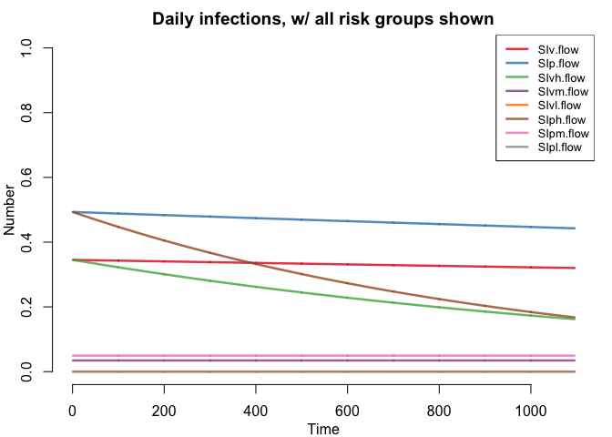
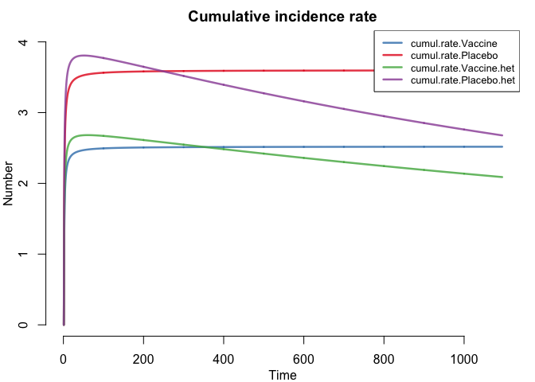
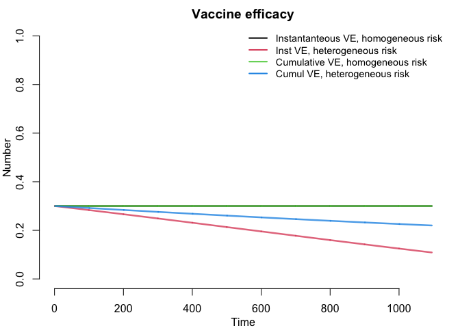

SI model of an HIV vaccine trial
================
Josh Herbeck
<<<<<<< HEAD
2021-02-24
=======
2021-02-23
>>>>>>> 4828bdd21750e60bbd5c5615fda0624bbde0e3ff

### Using models to assess the impact of vaccine leakiness on trial vaccine efficacy measures.

It is hypothesized that exposure heterogeneity (i.e. infection risk
heterogeneity) can affect efficacy estimation for leaky vaccines
<<<<<<< HEAD
(e.g. Halloran et al., 1992; White et al., 2010; O’Hagan et al.,2013;
Edlefsen, 2014; Coley et al., 2016; Gomes et al., 2016; Kahn et al.,
2018; Langwig et al., 2019). Our goal is to make a simple deterministic
compartmental model to facilitate straightforward simulation-based
=======
(e.g. Halloran et al., 1992; Halloran et al., 1996; White et al., 2010;
O’Hagan et al.,2013; Edlefsen, 2014; Coley et al., 2016; Gomes et al.,
2016; Kahn et al., 2018; Langwig et al., 2019). Our goal is to make a
simple deterministic compartmental model to facilitate simulation-based
>>>>>>> 4828bdd21750e60bbd5c5615fda0624bbde0e3ff
evaluation of this process within and across populations, in the context
of HIV prevention trials or longitudinal studies.

1.  In acute infection studies it seems like many participants get
    infected early. What is the magnitude of this effect that might be
    due to frailty bias?

2.  Assess if this effect might contribute to the differences between
    the RV 144 and HVTN 702 vaccine trial outcomes. (There has been a
    couple of analyses of this, and we can build on this and make future
    analyses of other trial results more straightforward to evaluate.)

3.  Assess if this effect might contribute to the waning efficacies seen
    in HIV prevention trials (specifically the AMP VRC01 bnAb trial).

4.  In the context of the AMP Trial and the different results seen in
    the sub-studies (703 vs 704); is this due to different forces of
    infection between the populations?

<<<<<<< HEAD
5.  Continue to raise awareness of this issue to HIV prevention trials,
    with the ultimate goal of better design and interpretation of
    efficacy outcomes.
=======
5.  Continue to connect this issue to HIV prevention trials.

“This results in disease rates that decrease over time, an output that
can be tested against time-to-event data.” *Pull time-to-event data from
my model via survival curves*
>>>>>>> 4828bdd21750e60bbd5c5615fda0624bbde0e3ff

From Gomes et al., 2016: “This effect is more pronounced in the control
group as individuals within it experience higher rates of infection
overall. Consequently, the ratio of disease rates in vaccinated over
control groups increases, and vaccine efficacy, as measured by simple
rate ratios, decreases as the trial progresses. Finally, the magnitude
of this effect increases with the intensity of transmission.”

### Model setup

We are modeling a closed population SI deterministic compartmental model
meant to simulate a vaccine trial. We are not modeling infections from I
to S but rather only infections from the outside (non-trial) population,
with the infection rate based on the population prevalence `prev` (of
viremic individuals), the exposure rate (serodiscordant sexual contacts
per time) `c`, and the transmission rate (per contact) `p`. The per
contact effect of vaccination is `epsilon`, and with this iteration of
the model `epsilon` is: 1) not time-varying (the per contact vaccine
effect does not decay over time); and 2) assumes a homogeneous effect
(does not vary by mark / viral genotype). This model structure also
removes the possibility of indirect effects from vaccination.

We are, with this early iteration, including just three subgroups in the
heterogeneous exposure population: high, medium, and low exposure. Right
now we do not know the correct size of these subgroups (i.e. fraction of
the population) or their relative contribution to overall incidence.
First pass is 10% high risk, 80% medium risk, 10% low risk (and low risk
is set at zero risk).

`beta` = transmission rate (per contact)  
`c` = exposure rate (serodiscordant sexual contacts per time)  
`prev` = prevalence (prevalence of viremic individuals)  
`lambda = beta * c * prev`  
`risk` = risk multiplier `epsilon` = per contact vaccine efficacy;
vaccine-induced reduction in the risk of HIV infection from a single
exposure

The risk multiplier is an amalgam of increases in transmission risk that
could be due to: 1) increased per contact transmission risk; 2)
increased exposure rate (number of contacts); or 3) increased prevalence
of HIV viremia in partners. Individual risk of infection can vary for
these separately or in combination.

Basic functions:

`dS/dt = -lambda*S`  
`dI/dt = lambda*S`

Sp = susceptible placebo  
Ip = infected placebo  
Sv = susceptible vaccinated  
Iv = infected vaccinated

Svh = susceptible vaccinated high exposure  
Svm = susceptible vaccinated medium exposure  
SvL = susceptible vaccinated low exposure (zero in this instance)  
Ivh = infected vaccinated high exposure  
Ivm = infected vaccinated medium exposure  
Ivl = infected vaccinated low exposure (zero in this instance)

### Calibration

We eyeball-calibrated the incidence to \~3.5% per 100 person years, to
be reasonably consistent with HVTN 702 in South Africa. (This is as of
right now, with more rigorous ABC calibration to come.) We used an
initial set of transmission parameters for sub-Saharan Africa borrowing
from Alain Vandormael (2018):

``` 
 "We used realistic parameter values for the SIR model, based on earlier HIV studies that have been undertaken in the sub-Saharan Africa context. To this extent, we varied `c` within the range of 50 to 120 sexual acts per year based on data collected from serodiscordant couples across eastern and southern African sites. Previous research has shown considerable heterogeneity in the probability of HIV transmission per sexual contact, largely due to factors associated with the viral load level, genital ulcer disease, stage of HIV progression, condom use, circumcision and use of ART. Following a systematic review of this topic by Boily et al., we selected values for `beta` within the range of 0.003–0.008. ... Here, we chose values for `v` within the range of 0.15–0.35, which are slightly conservative, but supported by population-based estimates from the sub-Saharan African context."
```

`c` varies from 50 to 120 per year  
`beta` varies from 0.003 to 0.008  
`prev`, which here is population prevalence of unsuppressed VL, varies
from 0.15 to 0.35  
`epsilon` could be parameterized using the RV144 Thai Trial results: VE
= 61% at 12 months, 31% at 42 months, but below we start with 30% and
not waning. Duration is not needed because we are only modeling a 3 year
trial without boosters.

### Initial parameter settings

``` r
beta <- 0.004   #transmission rate (per contact)
c <- 90/365    #contact rate (contacts per day)
prev <- 0.10   #needs some more consideration
lambda <- beta*c*prev
epsilon <- 0.30 #per contact vaccine efficacy
risk <- 10.0 #risk multiplier
```

### Model function; ODEs

Right now this includes just two vaccine trial populations, each with a
vaccine arm and a placebo arm. One population has homogeneous exposure /
risk of infection; the other population includes exposure heterogeneity,
and this heterogeneity is the same in both trial arms.

``` r
si_ode <- function(times, init, param){
  with(as.list(c(init, param)), {
    
    # Flows
    # the number of people moving from S to I at each time step
    #Susceptible, Infected, placebo
    SIp.flow <- lambda*Sp
    SIv.flow <- lambda*(1-epsilon)*Sv
    
    #Susceptible, Infected, placebo, high, medium, low
    SIph.flow <- risk*lambda*Sph
    SIpm.flow <- lambda*Spl
    SIpl.flow <- 0*lambda*Spl  #0 to give this group zero exposures
    
    #Susceptible, Infected, vaccine, high, medium, low
    SIvh.flow <- risk*lambda*(1-epsilon)*Svh
    SIvm.flow <- lambda*(1-epsilon)*Spl
    SIvl.flow <- 0*lambda*(1-epsilon)*Svl  #0 to give this group zero exposures
    
    # ODEs
    # placebo; homogeneous risk
    dSp <- -SIp.flow
    dIp <- SIp.flow  #lambda*Sp
    
    # vaccine; homogeneous risk
    dSv <- -SIv.flow
    dIv <- SIv.flow  #lambda*epsilon*Sv

    # placebo; heterogeneous risk
    dSph <- -SIph.flow
    dIph <- SIph.flow  #risk*lambda*Sph
    dSpm <- -SIpm.flow
    dIpm <- SIpm.flow  #lambda*Spm
    dSpl <- -SIpl.flow
    dIpl <- SIpl.flow  #0*lambda*Spl
    
    # vaccine; heterogeneous risk
    dSvh <- -SIvh.flow
    dIvh <- SIvh.flow  #risk*lambda*(1-epsilon)*Svh
    dSvm <- -SIvm.flow
    dIvm <- SIvm.flow  #lambda*Svm
    dSvl <- -SIvl.flow
    dIvl <- SIvl.flow  #0*lambda*(1-epsilon)*Svl

    #Output
    list(c(dSp,dIp,
           dSv,dIv,
           dSph,dIph,
           dSpm,dIpm,
           dSpl,dIpl,
           dSvh,dIvh,
           dSvm,dIvm,
           dSvl,dIvl,
           SIp.flow,SIv.flow,
           SIph.flow,SIpm.flow,SIpl.flow,
           SIvh.flow,SIvm.flow,SIvl.flow))
  })
}
```

### Running the model

We are using the EpiModel framework, <http://www.epimodel.org/>, with
help from Sam Jenness (Emory University).

``` r
param <- param.dcm(lambda = lambda, epsilon = epsilon, risk = risk)
init <- init.dcm(Sp = 5000, Ip = 0,
                 Sv = 5000, Iv = 0,
                 Sph = 500, Iph = 0,    #placebo, high risk
                 Spm = 4000, Ipm = 0,   #placebo, medium risk
                 Spl = 500, Ipl = 0,    #placebo, low risk
                 Svh = 500, Ivh = 0,    #vaccine
                 Svm = 4000, Ivm = 0,   #vaccine
                 Svl = 500, Ivl = 0,    #vaccine
                 SIp.flow = 0, SIv.flow = 0, 
                 SIph.flow = 0, SIpm.flow = 0, SIpl.flow = 0,
                 SIvh.flow = 0, SIvm.flow = 0, SIvl.flow = 0)

control <- control.dcm(nsteps = 365*3, new.mod = si_ode)

mod <- dcm(param, init, control)
mod
```

    ## EpiModel Simulation
    ## =======================
    ## Model class: dcm
    ## 
    ## Simulation Summary
    ## -----------------------
    ## No. runs: 1
    ## No. time steps: 1095
    ## 
    ## Model Parameters
    ## -----------------------
    ## lambda = 9.863014e-05
    ## epsilon = 0.3
    ## risk = 10
    ## 
    ## Model Output
    ## -----------------------
    ## Variables: Sp Ip Sv Iv Sph Iph Spm Ipm Spl Ipl Svh Ivh Svm 
    ## Ivm Svl Ivl SIp.flow SIv.flow SIph.flow SIpm.flow SIpl.flow 
    ## SIvh.flow SIvm.flow SIvl.flow

### Data manipulation; VE estimates

``` r
mod <- mutate_epi(mod, total.Svh.Svm.Svl = Svh + Svm + Svl) #all susceptible in heterogeneous risk vaccine pop
mod <- mutate_epi(mod, total.Sph.Spm.Spl = Sph + Spm + Spl) #all susceptible in heterogeneous risk placebo pop

mod <- mutate_epi(mod, total.Ivh.Ivm.Ivl = Ivh + Ivm + Ivl) #all infected in heterogeneous risk vaccine pop
mod <- mutate_epi(mod, total.Iph.Ipm.Ipl = Iph + Ipm + Ipl) #all infected in heterogeneous risk placebo pop

mod <- mutate_epi(mod, total.SIvh.SIvm.SIvl.flow = SIvh.flow + SIvm.flow + SIvl.flow) #all infections per day in heterogeneous risk vaccine pop
mod <- mutate_epi(mod, total.SIph.SIpm.SIpl.flow = SIph.flow + SIpm.flow + SIpl.flow) #all infections in heterogeneous risk placebo pop

#Incidence estimates, per 100 person years

#Instantaneous incidence / hazard
mod <- mutate_epi(mod, rate.Vaccine = (SIv.flow/Sv)*365*100)
mod <- mutate_epi(mod, rate.Placebo = (SIp.flow/Sp)*365*100)
mod <- mutate_epi(mod, rate.Vaccine.het = (total.SIvh.SIvm.SIvl.flow/total.Svh.Svm.Svl)*365*100)
mod <- mutate_epi(mod, rate.Placebo.het = (total.SIph.SIpm.SIpl.flow/total.Sph.Spm.Spl)*365*100)

#Cumulative incidence
mod <- mutate_epi(mod, cumul.Sv = cumsum(Sv))
mod <- mutate_epi(mod, cumul.Sp = cumsum(Sp))
mod <- mutate_epi(mod, cumul.Svh.Svm.Svl = cumsum(total.Svh.Svm.Svl))
mod <- mutate_epi(mod, cumul.Sph.Spm.Spl = cumsum(total.Sph.Spm.Spl))

mod <- mutate_epi(mod, cumul.rate.Vaccine = (Iv/cumul.Sv)*365*100)
mod <- mutate_epi(mod, cumul.rate.Placebo = (Ip/cumul.Sp)*365*100)
mod <- mutate_epi(mod, cumul.rate.Vaccine.het = (total.Ivh.Ivm.Ivl/cumul.Svh.Svm.Svl)*365*100)
mod <- mutate_epi(mod, cumul.rate.Placebo.het = (total.Iph.Ipm.Ipl/cumul.Sph.Spm.Spl)*365*100)

#Vaccine efficacy (VE) estimates

#VE <- 1 - Relative Risk; this is VE for instantaneous incidence / hazard
mod <- mutate_epi(mod, VE1.inst = 1 - rate.Vaccine/rate.Placebo)
mod <- mutate_epi(mod, VE2.inst = 1 - rate.Vaccine.het/rate.Placebo.het)

#VE <- 1 - Relative Risk; this is VE from cumulative incidence
mod <- mutate_epi(mod, VE1.cumul = 1 - cumul.rate.Vaccine/cumul.rate.Placebo)
mod <- mutate_epi(mod, VE2.cumul = 1 - cumul.rate.Vaccine.het/cumul.rate.Placebo.het)
```

### Model outputs

This hypothetical example has shows that exposure heterogeneity in a
simplified HIV vaccine trial can result in waning *realized* vaccine
efficacy, even as the per-contact vaccine efficacy remains stable. Also
note that exposure heterogeneity in a longitudinal study population may
result in elevated incidence in the early stages of the study, as the
high risk subgroup is depleted more quickly than the medium and low risk
subgroups.

``` r
par(mar = c(3,3,2,1), mgp = c(2,1,0))
plot(mod, y = c("Iv", "Ip", "total.Ivh.Ivm.Ivl", "total.Iph.Ipm.Ipl"), 
     alpha = 0.8, 
     main = "Cumulative infections",
     legend = "full")
```

<!-- -->

``` r
plot(mod, y = c("SIv.flow", "SIp.flow", "SIvh.flow", "SIvm.flow", "SIvl.flow", "SIph.flow", "SIpm.flow", "SIpl.flow"), 
     alpha = 0.8, 
     main = "Daily infections, w/ all risk groups shown",
     legend = "full")
```

<!-- -->

``` r
plot(mod, y = c("SIv.flow", "SIp.flow", "total.SIvh.SIvm.SIvl.flow", "total.SIph.SIpm.SIpl.flow"),
     alpha = 0.8, 
     main = "Daily infections, total mixed risk group",
     legend = "full")
```

<!-- -->

``` r
plot(mod, y=c("rate.Vaccine", "rate.Placebo", "rate.Vaccine.het", "rate.Placebo.het"),
     alpha = 0.8,
     #ylim = c(0, 0.1),
     main = "Instantaneous incidence rate",
     legend = "full")
```

<!-- -->

``` r
plot(mod, y=c("cumul.rate.Vaccine", "cumul.rate.Placebo", "cumul.rate.Vaccine.het", "cumul.rate.Placebo.het"),
     alpha = 0.8,
     #ylim = c(0, 0.1),
     main = "Cumulative incidence rate",
     legend = "full")
```

<!-- -->

``` r
plot(mod, y=c("VE1.inst", "VE2.inst", "VE1.cumul", "VE2.cumul"),
     alpha = 0.8,
     main = "Vaccine efficacy",
     legend = FALSE, 
     col = 1:4)
legend("topright", legend = c("Instantanteous VE, homogeneous risk", "Inst VE, heterogeneous risk", "Cumulative VE, homogeneous risk", "Cumul VE, heterogeneous risk"),
       col = 1:4, lwd = 2, cex = 0.9, bty = "n")
```

<!-- -->

*To do: time-to-event data from my model via survival curves*
